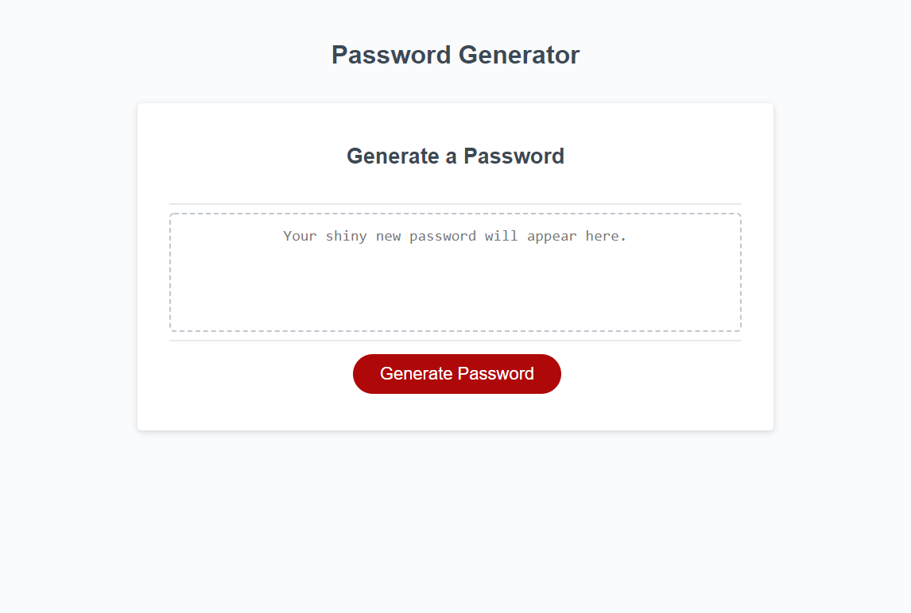

# passwordgenerator

A unique, random password generator.

# Generator
> Site example using Javascript to produce a secure password.
> Live site demo: [_Password Generator_](https://brandon-stewart-rgb.github.io/passwordgenerator/). 

## General Information

A site developed for the purpose of generating a unique, random password.

### Technologies Used

        * Javascript
        * Gitbash
        * Github
        * Gitpages
        * GoFullPage
        * Visual Studio Code 

        

#### Screenshot
 

